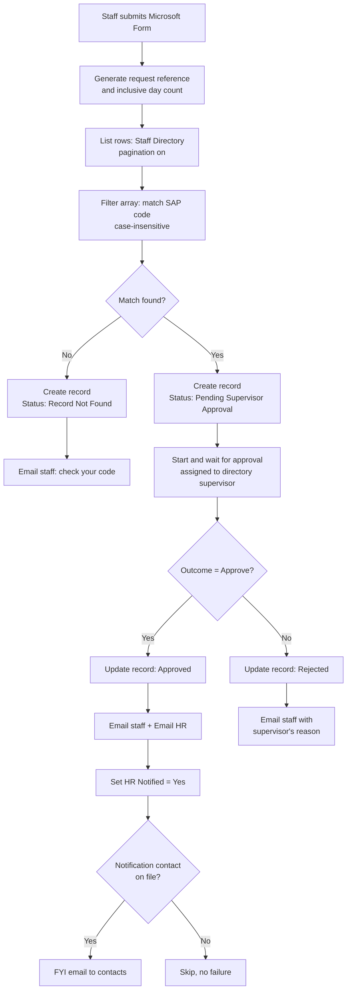
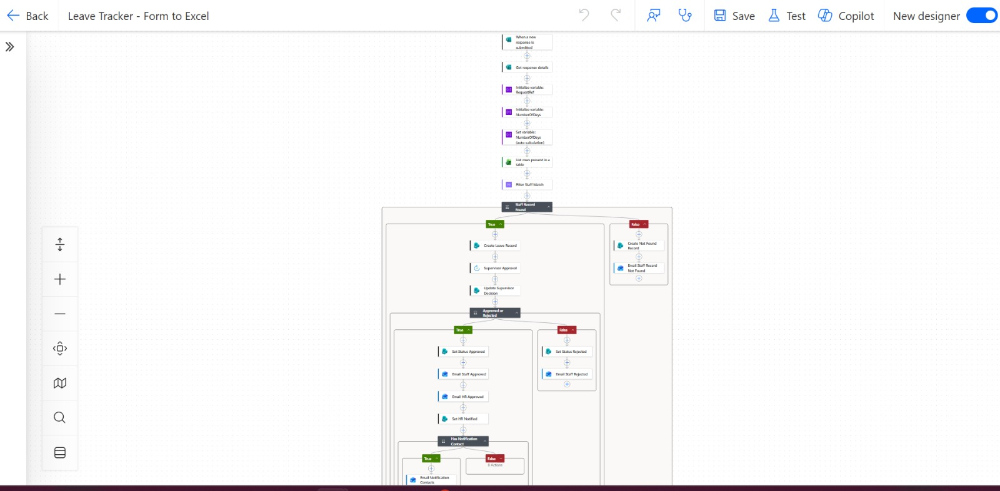
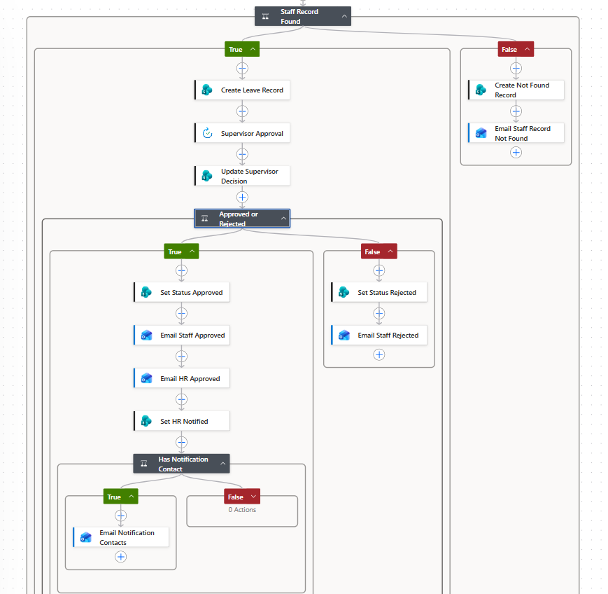
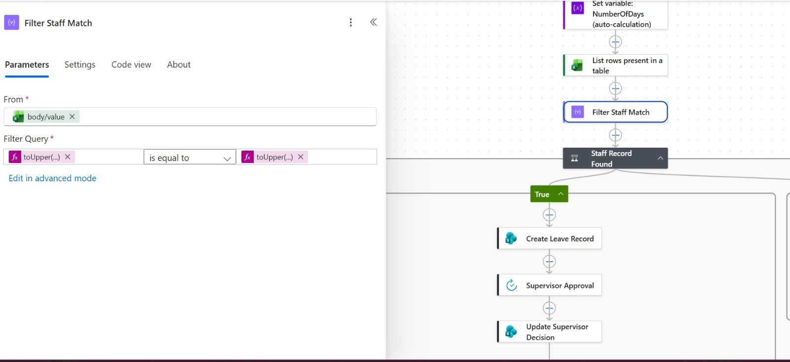
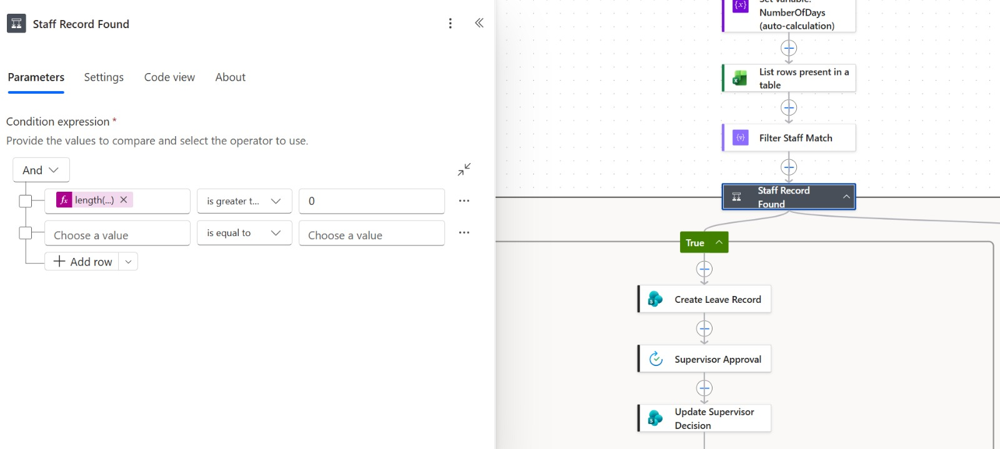
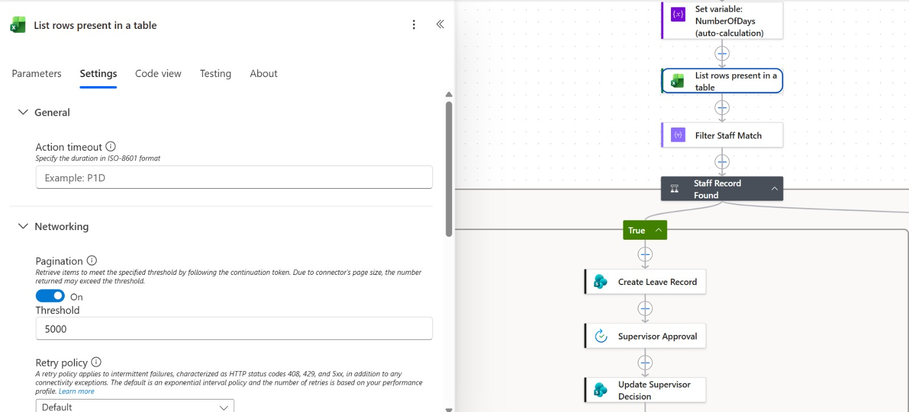
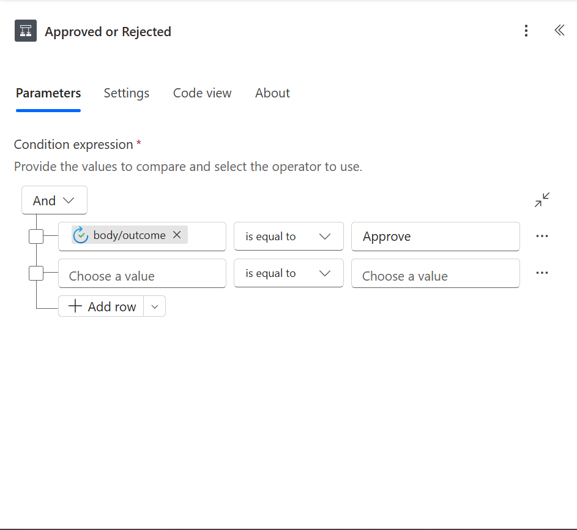
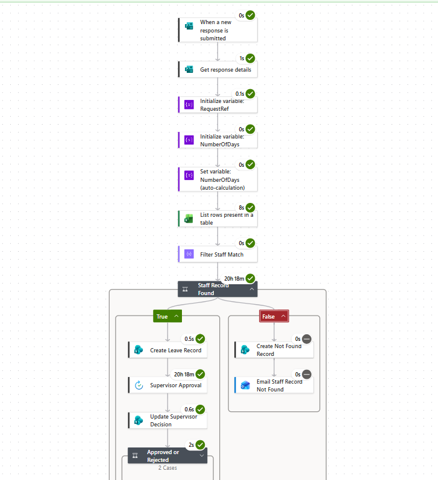
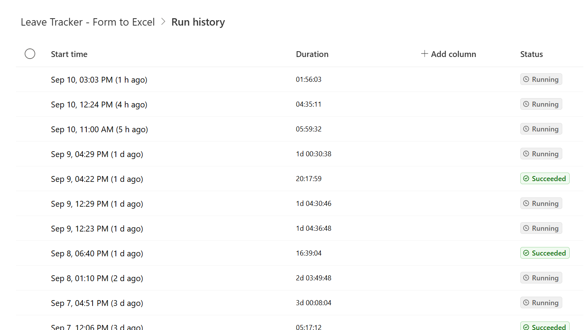

# Leave Request Automation


An end-to-end leave approval system built on Microsoft 365. A staff member submits a
one-minute form; the flow validates them against a live staff directory, routes the
request to their own supervisor, writes every decision back to a single record, and
notifies the staff member, HR, and any listed contacts. A Power BI layer on top gives
HR period-based reporting (this week, this month, last 3 months and more) from the
same records.

**Stack:** Power Automate · Microsoft Forms · Excel Online (Business) · SharePoint Online ·
Approvals · Office 365 Outlook · Power BI

---

## Why I rebuilt it

The first version of the flow worked on a good day and failed quietly on a bad one:

| Problem in v1 | What caused it | What v2 does instead |
|---|---|---|
| Slow runs on every request | Looped through all ~430 directory rows with a condition inside the loop | One `List rows` + one `Filter array` + `first()`. No loops at all |
| Updates failing with `NotFound` | The item ID came from an unreliable reference | Creates the record first, then updates it by the ID that create returned |
| No trail when things went wrong | Failed lookups ended the run with nothing recorded | Every submission creates a record, including unmatched ones (`Record Not Found`) |

Patching v1 would have meant working around its structure, so I rebuilt it from scratch
and tested four paths end to end before it went live.

---

## How it works



<p align="center"></p>
<p align="center"><em>The flow as built in Power Automate</em></p>

### Status model

Every request lives in one SharePoint row and moves through a small, explicit set of states:

`Record Not Found` · `Pending Supervisor Approval` · `Approved` · `Rejected`

Because the unmatched case is a status rather than a dead end, HR can see and fix
directory gaps instead of hearing about them from frustrated staff.

<p align="center"></p>
<p align="center"><em>Staff Record Found splits matched and unmatched requests; Approved or Rejected routes the decision</em></p>

<!-- SharePoint list screenshot: remove this line and the closing marker below once 05-sharepoint-list.png is uploaded
<p align="center"></p>
<p align="center"><em>One row per request in the Leave Requests list, one status per stage</em></p>
-->

---

## Engineering decisions worth knowing about

These are the non-obvious parts. Most of them came from a real failure during the build.

**1. A lookup that matched nothing and raised no error.**
Valid staff codes kept returning "record not found". The raw `Filter array` output showed
an empty array, and the filter was reading `item()?['SAPCODE']` while the actual Excel
header is `SAP Code` (with a space). A property that doesn't exist returns null, null
matches nothing, and Power Automate reports success. Lesson: read the raw outputs, not
the run's green ticks. The `length() > 0` guard is what turned this silent failure into
a visible `Record Not Found` record.

<p align="center"></p>
<p align="center"><em>Filter Staff Match: both sides upper-cased before comparing</em></p>

<p align="center"></p>
<p align="center"><em>The guard: no match means the Record Not Found branch, not a silent failure</em></p>

**2. Filter in `Filter array`, not in the Excel connector's Filter Query.**
The Excel connector's Filter Query is a limited OData dialect with no `trim()`,
`toUpper()` or `toLower()`. Staff type codes in mixed case, so matching happens in
`Filter array`, where both sides are wrapped in `toUpper()` before comparing.

**3. Pagination is off by default, and the cap is silent.**
`List rows present in a table` returns 256 rows unless pagination is switched on.
Anyone below row 256 would fail the lookup with no error. Pagination is set to a
5,000-row threshold.

<p align="center"></p>
<p align="center"><em>Pagination on, threshold 5,000</em></p>

**4. Create first, then update by your own ID.**
`Create item` returns the ID of the row it wrote. Every later update uses
`outputs('Create_Leave_Record')?['body/ID']`, so there is no `Get items → Apply to each →
Update item` chain and none of the loop-scope errors that come with it.

**5. The Approvals connector omits `comments` when the approver leaves it blank.**
It doesn't return an empty string; the property is missing, and reading it directly
fails the run. Every comment read is wrapped in `coalesce(..., 'No comments provided')`.

**6. The approval outcome is `Approve`, not `Approved`.**
Comparing against `Approved` sends every request down the rejected branch without
any error.

<p align="center"></p>
<p align="center"><em>The outcome check uses the connector's actual value</em></p>

**7. The form is anonymous, so responder metadata is useless.**
Responder email comes back as `anonymous`. Staff replies go to the email the form
itself asks for.

**8. Optional recipients are guarded, and normalised for Outlook.**
Some staff have no notification contact. `Send an email` fails hard on an empty To
field, which would fail the run after the approval had already happened. A condition
skips the FYI email when the field is empty, and `replace(..., ',', ';')` handles
contacts entered with commas instead of semicolons.

**9. Flags are set in their own step so they tell the truth.**
`HR Notified` is updated in a separate action after the HR email. If the email fails,
the flag stays `No`, which is correct.

**10. The key is `Request Reference`, never `Title`.**
SharePoint's `Title` column has quirks and was never meant as a business key.

---

## Reporting layer (Power BI)

The SharePoint list feeds a Power BI report with a reusable period selector:

- **`Dim Date`** built with `CALENDARAUTO()`, with Year, Month, Month-Year and
  rolling-period flag columns.
- **`SpecialDates`**, a disconnected table of 11 named periods (Last 7 Days, Last 30
  Days, Last Month, Last 3 Months, Last 6 Months and more) built with
  `UNION` / `ADDCOLUMNS` / `SELECTCOLUMNS`.
- A **`TREATAS`** measure that applies the selected period's dates to `Dim Date`, and an
  **In Selected Period** measure used as a visual-level filter so the detail table
  follows the slicer.
- Slicers for Zone, Application Status, Staff Name, Supervisor Name and Period.

The one trap: `SpecialDates` must have **no relationship** to `Dim Date`. `TREATAS`
supplies the link at query time, and an auto-detected relationship breaks it.
Details and DAX patterns are in [docs/power-bi-date-layer.md](docs/power-bi-date-layer.md).

<!-- Power BI screenshot: remove this line and the closing marker below once 06-power-bi-report.png is uploaded
<p align="center"></p>
<p align="center"><em>Period slicer set to Last 3 Months; the detail table follows it</em></p>
-->

---

## Testing

The flow went live only after four paths passed end to end:

| # | Scenario | Expected result |
|---|---|---|
| 1 | Valid code, approved with a comment | Status `Approved`, staff + HR emails sent, `HR Notified = Yes` |
| 2 | Valid code, rejected with a comment | Status `Rejected`, staff email includes the reason |
| 3 | Invalid code | Status `Record Not Found`, staff asked to check their code |
| 4 | Valid code, approved with no comment | Completes cleanly; comment reads "No comments provided" |

Also worth running once: point a test row's supervisor at a colleague and confirm the
approval lands in their Approvals centre. Approving your own request tests the wiring,
not the delegation.

<p align="center"></p>
<p align="center"><em>A completed run: the approval step waited 20h 18m for the supervisor, then everything else finished in seconds</em></p>

---

## Results

- Manual processing of leave requests reduced by **30%**.
- One authoritative record per request, from submission to decision, queryable by
  status, person, department or period.
- Directory lookup cut from a loop over every staff row to a single filter.
- Unmatched submissions are captured and visible instead of silently lost.

---

## Roadmap

- **Date validation:** reject requests where the end date is before the start date
  (day count below 1) before a record is created.
- **Stuck-request watchdog:** a scheduled flow that finds requests sitting in
  `Pending Supervisor Approval` beyond a set number of days and reminds the supervisor,
  so approvals don't time out silently.

<p align="center"></p>
<p align="center"><em>Live runs waiting on supervisor decisions for up to three days. A run that waits 30 days times out, and the request would stay Pending Supervisor Approval with no one told</em></p>

---

## Repository contents

```
leave-request-automation/
├── README.md
├── docs/
│   ├── build-guide.md          step-by-step flow build with expressions
│   ├── data-model.md           form fields, staff directory, SharePoint list schema
│   └── power-bi-date-layer.md  date table, period selector, DAX patterns
└── screenshots/                flow, run and report screenshots (test data only)
```

## Rebuilding it

Everything uses standard Microsoft 365 connectors, with no premium licensing. Build
order: SharePoint list and Excel table → form → flow, one branch at a time, testing each
path before adding the next. Full steps are in [docs/build-guide.md](docs/build-guide.md).

---

*No credentials, internal email addresses, employee data, form IDs or tenant-specific
identifiers are included in this repository. Test codes shown (`TEST002`, `ZZZ999`) are dummies.*
