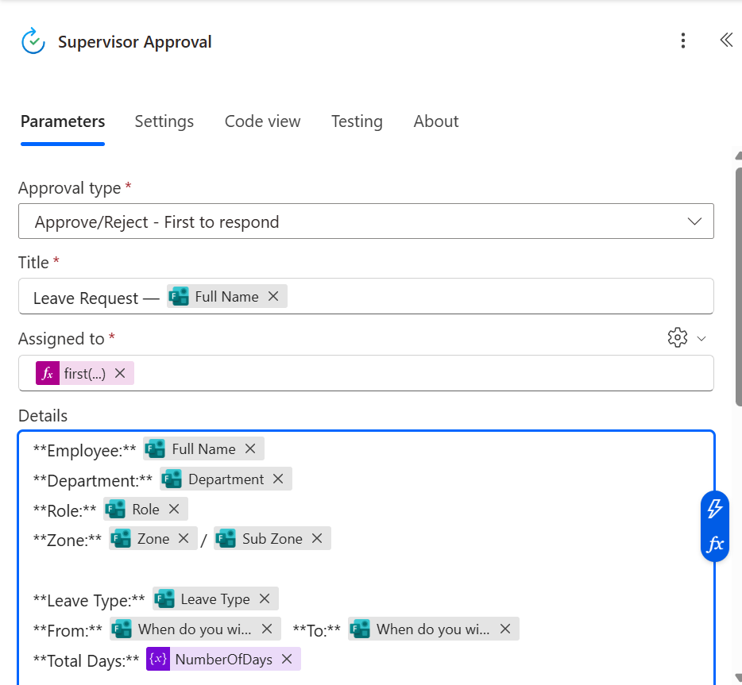

# Build Guide

Action names below are the renamed names used in the flow. Renaming matters: later
expressions reference actions by name, and two actions both called `Create item`
become confusing fast.

Form field IDs are shown as `<start-date-field-id>` style placeholders. Get the real
keys from the raw output of `Get response details` in a test run.

---

## Stage 1: Capture the request

**Trigger:** Microsoft Forms, *When a new response is submitted*.

**Get response details** for that response.

**Initialize variable `RequestRef`:** a unique reference generated at the start of the
run, in the form `LR-<yyyyMMdd>-<6-character suffix>` (for example `LR-20260724-4b7160`).
It is the business key and is quoted in every email.

**Initialize variable `NumberOfDays`**, then **Set variable `NumberOfDays` (auto-calculation):** inclusive day count. 20 to 24 July is 5 days, not 4.
Both dates are normalised to midnight first, because Forms can return a time component
and a non-zero time on one side makes `div()` truncate to an off-by-one:

```
add(
  div(
    sub(
      ticks(formatDateTime(body('Get_response_details')?['<end-date-field-id>'], 'yyyy-MM-dd')),
      ticks(formatDateTime(body('Get_response_details')?['<start-date-field-id>'], 'yyyy-MM-dd'))
    ),
    864000000000
  ),
  1
)
```

## Stage 2: Find the staff member

**List rows present in a table** on `StaffDirectory`.
Settings → **Pagination: On, threshold 5000**. Without this the action silently stops
at 256 rows.

Leave the connector's Filter Query empty (it can't trim or change case).

**Filter array**, renamed `Filter Staff Match`: from the List rows `body/value`, keep rows
where `toUpper()` of the directory code equals `toUpper()` of the submitted code. The
left side must reference the header exactly: `item()?['SAP Code']`.

**Condition** `Staff Record Found`: `length(body('Filter_Staff_Match'))` is greater than `0`.

## Stage 3a: No match (False branch)

**Create item** `Create Not Found Record`: form fields, `NumberOfDays`, Status
`Record Not Found`, `HR Notified = No`, supervisor fields left empty.

**Send an email** `Email Staff Record Not Found`: tells the staff member the code they
typed didn't match, and shows them what they typed. Most failures are typos, and showing
the value resolves them without an HR round trip.

## Stage 3b: Match found (True branch)

**Create item** `Create Leave Record`: same mappings, plus:

| Field | Value |
|---|---|
| Supervisor Name | `first(body('Filter_Staff_Match'))?['Supervisor']` |
| Supervisor Email | `first(body('Filter_Staff_Match'))?['SupervisorEmail']` |
| Supervisor Decision | Pending |
| Status | Pending Supervisor Approval |

Use `first()` rather than `[0]`: on an empty array `[0]` throws, `first()` returns null.
The condition already guarantees a match here, but the habit is worth keeping.

**Start and wait for an approval** `Supervisor Approval`:

- Type: *Approve/Reject – First to respond*
- Title: `Leave Request — <Full Name>`
- Assigned to: `first(body('Filter_Staff_Match'))?['SupervisorEmail']`
- Details: employee, department, role, zone, leave type, dates and total days, so the
  supervisor can decide from the card without opening anything else

<p align="center"></p>

The run stays open while it waits. In testing, one approval sat for over 20 hours
before the supervisor responded.

**Update item** `Update Supervisor Decision` records the decision on the same row (Id: `outputs('Create_Leave_Record')?['body/ID']`),
with comments read safely:

```
coalesce(first(outputs('Supervisor_Approval')?['body/responses'])?['comments'], 'No comments provided')
```

**Condition** `Approved or Rejected`: `body/outcome` equals `Approve` (not `Approved`).

## Stage 4a: Approved

1. **Update item `Set Status Approved`**: Status `Approved`.
2. **Email Staff Approved** with dates, day count, supervisor comments and reference.
3. **Email HR Approved** with employee, department, zone, dates and reference.
4. **Update item `Set HR Notified`**: `HR Notified = Yes`. Placed straight after the HR
   email and kept separate, so the flag stays `No` if that email fails.
5. **Condition `Has Notification Contact`:**
   `empty(first(body('Filter_Staff_Match'))?['NotificationEmail'])` is equal to `false`.
   In the True branch, **Email Notification Contacts** with To:
   ```
   replace(string(first(body('Filter_Staff_Match'))?['NotificationEmail']), ',', ';')
   ```
   Leave the False branch empty, so a blank contact skips the email instead of failing the run.

## Stage 4b: Rejected

1. **Update item `Set Status Rejected`**: Status `Rejected`.
2. **Email Staff Rejected** including the supervisor's reason, with a note that they can
   submit a new request if their dates change.

---

## Test before go-live

Run all four paths in the README's testing table, then one delegation test with a
colleague as supervisor.
